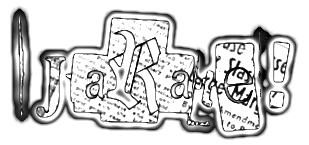
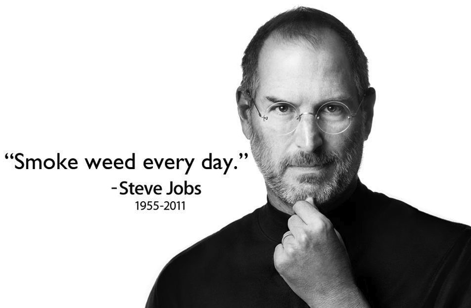

# See You Next Wednesday

There's a movie. Spies like us with Dan Akroyd and the other guy... Chevy Chase. It's a halfway decent movie to watch when you're sick or just bored I guess. I enjoyed it, it has some iconic lines like the infamous, "Doctor" scene. Everyone does that at one point it seems. There are some great scenes but it's just a bit snowy to be taken too seriously. Even though thats not the main focus a lot of action and climax take place during this scene it's just tedious. If you are ill or perhaps somewhat distracted by boredom, you wouldn't notice it as much perhaps. Some people do not mind and enjoy it.  

## My Point?

There is a movie poster in that scene and it's called [See You Next Wednsday](https://en.wikipedia.org/wiki/See_You_Next_Wednesday). It was a name of a movie that had never been made. There was always talks but the movie had never actually gotten made. Each time it was referenced it was a different movie altogether. I don't know why I felt the need to research that poster, nor do I fully understand it, but the details led me to some pretty interesting caviats. Stuff that I had no idea was actually quite interesting.  

  
Jarate was a jar of urine the sniper class had in the free to play flagship steam game, Team Fortress 2. You threw a jar of urine at people. Grown men, playing with kids.  

### ummmm....

You wouldn't expect to get entertainment out of a documentary about the price is right. But it's there. These kind of things, they are usually truths, just have a way of fascinating us. They are enlightenments, organic, and they are real. It's so obvious when producers just phone it in and they just expect a mass horde to just appreciate whatever they put in front of them. It's so obvious when they just fake it and try to show a sense of superiority by not adhering to nuance and sublty with the respect it deserves. Thier middle man status never shines so bright as when they try to maniplulate the artisty. Middle men aren't artists. They just get caught up in the hype. Remember that when appreciating a work, it's been manipulated with some weirdo's basically breathing and touching all over it.  

# Anything Else?

I don't want to play computer games anymore. They were always so toxic. We were just trying to have fun, have a pleasant time using teamwork and constructive gaming. These guys come in with their racist comments, anyone who's ever gamed before knows how toxic it used to be. I just can't do it anymore. I had NO IDEA it was affecting me so deeply. It does. Not the games themselves, but the toxic people who use it to pretend they are real life bad guys and they actually are. It's a mess. There are so many terrible people those games attract. If i had it do over again? No multiplayer. I would hate to miss out on the interactions we had, those times were golden with my TRUE online gaming friends. Anyone who knows me for real? Knows how much fun and how focused and cool the times can be. Its fun, its just not do or die for me. It's just pure fun!  

Usually I flip out because you do get targeted and I can't believe these idiots just won't leave me alone. It's like, WHAT DO I GOTTA DO TO MAKE EM STOP STALKING ME... right? We all get into it and no one cares about incidents. That's what they are for, we are talking about straight up stalkers who don't have fun, they don't know what they are doing, and they are just crazy flying off the handle hurting people online cause its not illegal. Those idiots. They are the same ones who do the zoom bombing i guess. See, stuff like that, I just cant imagine anyone doing and I fly into a rage just thinking about it. Ugh.  

  

I had no idea when asked it was affecting me so poorly though, but it was. Heck, I just wanted to keep playing. I felt I needed to. I would not let my kid do online gaming, only gaming with friends. My mother knew this stuff she was the only voice of reason in my life to be honest.  

Alas, I digress.... I'm recovering but it feels like I was shot with something like a novacaine when you go to the dentist. My whole face feels numb and when I shower I can definitely tell. It might have been like a botox even. I feel numb in my face and head and there are impact marks on my face. Specifially there are 3 impact marks.  

My cognitive functions are bad. I'm slurring and forgetting and I can just tell its going to be yet another road to recovery. There is no way I'd visit a hospital again. That socialist crap and their socialist communist medicine? No thanks. give me my hemp, you commie bastards.  

  
