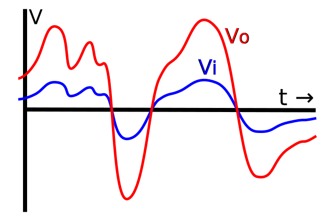

<script lang="ts">
  import Youtube from '$lib/components/youtube.svelte'
  import Custom from '$custom/custom.svelte'
  const const_variable = 999;

  import Folder from '$lib/components/folder.svelte'

  let configFolder = [
    { name: 'QWER.config.js', icon: 'i-vscode-icons-file-type-typescript-official' },
    { name: 'site.ts', icon: 'i-bxs-file-js' }
  ]
</script>

## Paragraphs


**Lorem Ipsum** dolor sit amet, consectetur adipiscing elit, sed do eiusmod tempor incididunt ut labore et dolore magna aliqua. This is the content: **_The_** _quick_ <u>brown</u> [fox](https://www.foxnews.com/) `jumps` ~~over~~ the lazy **dog**.

This is ||Spoiler Text||.

> Lorem ipsum began as scrambled, nonsensical Latin derived from Cicero's 1st-century BC text De Finibus Bonorum et Malorum.

<kbd>↑</kbd> <kbd>↑</kbd> <kbd>↓</kbd> <kbd>↓</kbd> <kbd>←</kbd> <kbd>→</kbd> <kbd>←</kbd> <kbd>→</kbd> <kbd>B</kbd> <kbd>A</kbd> <kbd>Start</kbd>

<kbd>Ctl + C</kbd> <kbd>Ctl + V</kbd>

<sup>Lorem</sup> <sub>ipsum</sub> <cite>dolor sit amet</cite>, <acronym title="Consectetur Adipiscing Elit">consectetur adipiscing elit</acronym>, <abbr title="Aliqua">sed do eiusmod tempor incididunt ut labore et dolore magna aliqua</abbr>.

### Ordered List

1. First item
2. Second item
3. Third item

### Unordered List

- First item
- Second item
- Third item

### Checkbox List (ul)

- [ ] List Item 1 unchecked
- [x] List Item 2 checked
- [x] List Item 3 checked

## Katex

### Katex Block

Katex Block are facanced by

````text
```math
Tex Syntax
```
````

Example of Fractions and Binomials

```math
\frac{n!}{k!(n-k)!} = \binom{n}{k}
```

Also

```math
\frac{\frac{1}{x}+\frac{1}{y}}{y-z}
```

### Katex Inline

Katex inline are facanced by

````text
`$kaTex Inline Text$`
````
`$\KaTeX$`  

This `$n^{22}$` and that `$\cos (2\theta) = \cos^2 \theta - \sin^2 \theta$`  

### Chemical Typesetting

```math
\ce{Zn^2+  <=>[+ 2OH-][+ 2H+]  $\underset{\text{amphoteres Hydroxid}}{\ce{Zn(OH)2 v}}$  <=>[+ 2OH-][+ 2H+]  $\underset{\text{Hydroxozikat}}{\ce{[Zn(OH)4]^2-}}$}
```
Power gain, in decibels (dB), is defined as follows:  
```math
\text{gain-db}=10 \log_{10} \left(\frac{P_\text{out}}{P_\text{in}}\right)~\text{dB},
```
where `$P$`in is the power applied to the input, `$P$`out is the power from the output.  

A similar calculation can be done using a natural logarithm instead of a decimal logarithm, resulting in nepers instead of decibels:  
```math
\text{gain-np} = \frac{1}{2} \ln\left(\frac{P_\text{out}}{P_\text{in}}\right)~\text{Np}.
```




## Footnotes

In electronics, gain is a measure of the ability of a two-port circuit (often an amplifier) to increase the power or amplitude of a signal from the input to the output port by adding energy converted from some power supply to the signal. It is usually defined as the mean ratio of the signal amplitude or power at the output port to the amplitude or power at the input port[^1]. Sources [^2][^3][^4]

[^1]: Graf, Rudolf F. (1999). Modern Dictionary of Electronics (7 ed.). Newnes. p. 314. ISBN 0080511988.

[^2]: Basu, Dipak (2000). Dictionary of Pure and Applied Physics. CRC Press. p. 157. ISBN 1420050222.  

[^3]: Bahl, Inder (2009). Fundamentals of RF and Microwave Transistor Amplifiers. John Wiley and Sons. p. 34. ISBN 978-0470462317.  

[^4]: White, Glenn; Louie, Gary J (2005). The Audio Dictionary (3 ed.). University of Washington Press. p. 18. ISBN 0295984988.  
    `{ eof }`  
    

## Info Block

:::info This is the title

This is the content: **_The_** _quick_ <u>brown</u> [fox](https://www.foxnews.com/) `jumps` ~~over~~ the lazy **dog**.

:::

## Table

| Table Header 1 | Table Header 2 | Table Header 3 |
| -------------- | -------------- | -------------- |
| Division 1     | Division 2     | Division 3     |
| Division 1     | Division 2     | Division 3     |
| Division 1     | Division 2     | Division 3     |

| Align Left | Align Center | Align Right |
| :------------- | :------------: | -------------: |
| Division 1     |   Division 2   |     Division 3 |
| Division 1     |   Division 2   |     Division 3 |
| Division 1     |   Division 2   |     Division 3 |

## Code Block

```ts
/// title: examples/index.ts
for (let x in [0]) console.log(x);
```

```ts
/// showLineNumber
/// diff
/// title: typescript-helloworld.ts
/// hlLines: 2,3-5
class Greeter {
    constructor(public greeting: string) { }
    greet() {
        return "<h1>" + this.greeting + "</h1>";
    }
};

+ var greeter = new Greeter("Hello, Ministry of Programming!");
+ var str = greeter.greet();
- console.log("Test");
```

## Image

Just image


Image with subtitle

<ImgZoom src="/example/example1.jpg" alt="Example1" class="h-full object-cover">
Photo by <a href="https://unsplash.com/@willy24?utm_source=unsplash&utm_medium=referral&utm_content=creditCopyText">Ioana Tabarcea</a> on <a href="https://unsplash.com/s/photos/morning?utm_source=unsplash&utm_medium=referral&utm_content=creditCopyText">Unsplash</a>
</ImgZoom>

Shared image from `/user/assets/shared/`

```md

```


## Videos / GIF


## Youtube

<Youtube id="nvQz-OjfZCs"/>

## Custom Svelte Component

<div class="p4 border-1 shadow-xl rounded-xl border-black dark:border-white overflow-auto">
  <Folder name="config" files={configFolder} expanded/>
</div>

<div class="my4">
  <Custom name="custom object" />
</div>

```svelte
<script lang="ts">
  const const_variable = 999;
</script>

Variable is {const_variable}
```

Variable is {const_variable}

```svelte
{(function () {
const guess = Math.random()

if (guess > 0.66) {
return `<span style="color: tomato">Look at us.</span>`
}

if (guess > 0.33) {
return `<span style="color: violet">Who would have guessed?!</span>`
}

return `<span style="color: goldenrod">Not me.</span>`
})()}
```

{(function () {
const guess = Math.random()

if (guess > 0.66) {
return `<span style="color: tomato">Look at us.</span>`
}

if (guess > 0.33) {
return `<span style="color: violet">Who would have guessed?!</span>`
}

return `<span style="color: goldenrod">Not me.</span>`
})()}

## 👍 END

<Youtube id="sul16s0VSzs"/>