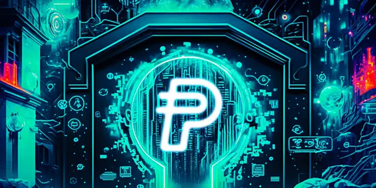
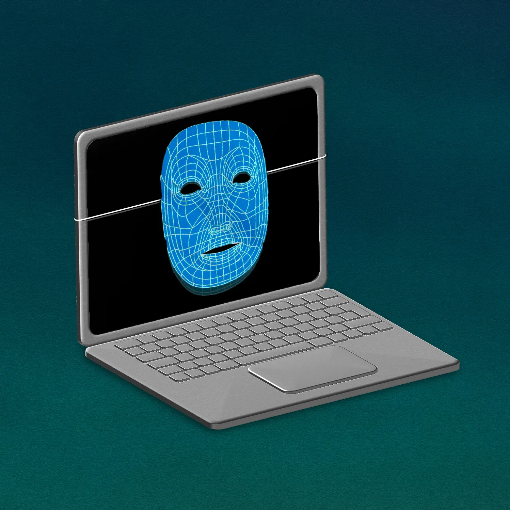
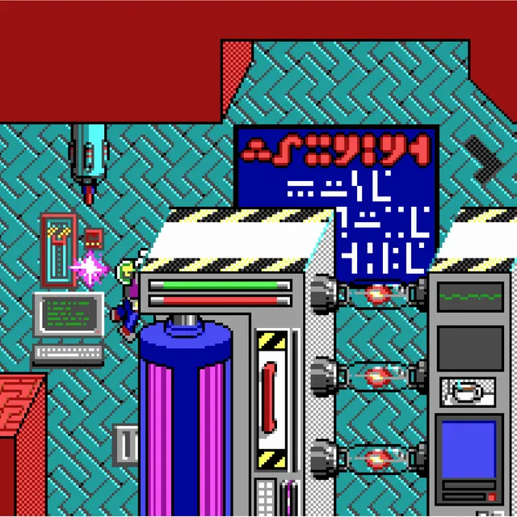
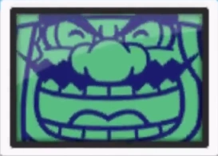
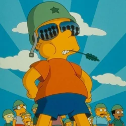

# Happy New Year 2024

We would like to say this year will be our year. That's the repeating tone I kept hearing all throughout the past year end celebrations. However, this time, I'm just going to say the future will be positive and the future is now. It won't just be my year, I'm not in any competition for first place on winning a new years statement. Even if I did place 1st for winning, how would one celebrate a thing like that? I guess just more of the same thing. Then it becomes less of a laurel and more of a way of life.  

At any rate, I've been able to identify all the 'bugs' in my life. Well, probably not all of them... but, enough to make a difference. Things are what they are. I was always expecting more. I was always waiting for a part 2 to everything but there was never any more, things are what they are. That's why its detrimental to fill kids heads with fantasies they go around believing there is more to life than what it is. It's okay to believe, it's not okay to take that leap of faith based on beliefs alone. Unless you are willing to fully accept the consequences, it's something that is better left to those who are sure of their outcomes.  

And that was the thing. I was always expecting other people to congratulate me or some kind of event when I did the right moves or lined up the right shots. It just doesn't happen, these are things that are scripts in movies. At least they don't happen out in the world where one believes it takes place. They do happen, in our homes, in our community. No stranger is going to celebrate you, they are just hoping you don't embarrass them while they try to make it through the day in one piece.  

# Donations

  

Let's talk a minute about donations. I've been around on the internet for quite some time and I can tell you it is nothing like what it appears to be. Almost every place that was free and was fun, they asked for donations. Never being in the position to donate I always felt kinda bad about not being able to donate. I always pictured the people asking as swimming in cash like a Scrooge McDuck. What would my little $5 donation do anyway? It never made sense to me. Now I'm starting to understand that I was probably the only one thinking about donating to some of these little hole in the wall places on the internet. It's just not what you think. I've done a lot of work online and been a part of a lot of things and it always felt capped. No one was ever able to really get what they needed and the causes were so many that it just was out of control and there was no space for us.  

I've hosted clans, servers, and websites and never once asked for donations. We tried a member dues to try to sweeten some type of pot deal, but it just never happened. Most of the time we did not have the required people interested to even interact with us, let alone donate. It just isn't as common as one would think. I used to believe if someone had a donate button on the internet they were golden. That's why I decided to put one on the front page with a meter. I've never been a part of something where they donated other than the people who were responsible for running the charity. It just doesn't happen that much. It makes me wonder about the legitimacy of telethons. I'm sure a telethon that is nationwide might get the attention, but you'd be surprised at what does and what doesn't get traction.  

I've never had a donation pool or a charity. However, now that I am fully understanding of the implications and repercussions of such a thing, I'm starting to see how they can be important. Don't see that button and just think I'm set, cause it's got more cobwebs than my bank account at this point.  

# Artificial Intelligence 

  

Ai could be a powerful tool to cut back on electricity usage, save you gas money on routes, organize your shopping habits, or even manage your spare time efficiently. They are thinking about replacing their social media fluffers with AI. That's going to be really heartbreaking when someone realizes their best friend is just a computer program of some previous person's chats.  

I don't think that these people who are asking for regulations even know what they are talking about. It's hard to distinguish what an AI is and what is just part of the program. There is a lot of talk, there is a lot of noise, but there is very little substance. We must define what the AI is. What is a script? What is an AI Choice? etc. To miss this opportunity to clearly define and bring to light what companies are already trying to hide would be another huge blow to America's industry at this point. We cannot take any more losses and expect to come out ahead. AI is an area that demands attention. Whether we like it, or not....  

# Memories

  

I remember I'd spend mornings plopped in front of the computer playing commander keen just trying to master those levels. The mechanics were great, the skill level was enough to hold my interest and the story and cut scene extras were also just extraordinary. I loved every minute playing on my joypad/gamepad that was also a challenge to install. We had Sound Blaster cards back then. I still remember having to set up everything and all that. We had to mess with timings and jumpers and voltages back then. There was no safety net and we used to blow chips just using them regular without any extra setups. It was quite the time.  

# Dr. Evil

  

That idiot, Wario, is still throwing whatever the heck he throws at me. I don't really care to mention who it is but they're still there. I've noticed that its only when I stray off my path that there is any trouble. So it's not that big an issue. I've learned not to try to kill my enemy anymore. I've learned that not every problem that I'm being faced with should end in some type of victory. It's just some stupid stuff and just have to deal with it like everyone else. So that's the end result. If I get the chance, I'm going to take it but I'm not going out my way.  

# Peace!

  

That's pretty much it. I'm tired but not tired enough to quit. I'm just at a loss on how to one up myself and which way up I should go. That's it. I'm at peace. I'm a little shocked at how totally screwed up everything is but whatever, nothing new I suppose. I'm just going to keep going forward. Here's to another fine year. 

<Youtube id="rZjGD0EKlzk" />
