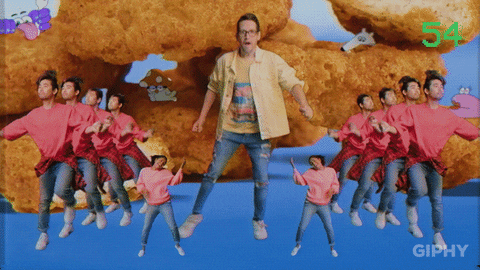
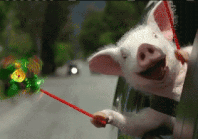
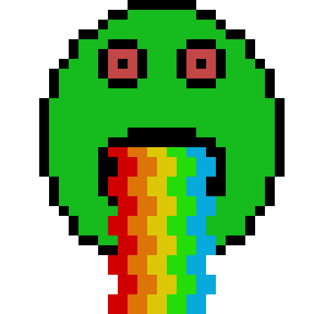

# We kinda got mixed up and turned around

Let's just ignore the fact that everything has become extremely strange lately. While we are at it, let's also ignore how everyone is just going for it. Against better judgments everywhere.... Let's try to just overlook these awkward, awkward things and resist the urge to just dive in....  

  

It's the end of the year and it is time to reflect on how things went. For most of it, I've spent my time ranting, raving, coding, and recovering. I did some serious time in the hospital due to an unknown pathogen. I'm just happy to be feeling better, I took the prescribed medicine and it seems to be helping. I've changed my eating habits because as much as it seems like the year 2000, it just isn't. I've been eating so much hard foods and it just finally took it's toll. There are other factors that are ramping up the effects but I just need to make a change. I felt sick when drinking 7+ cups of coffee every day, all day. I should have paid attention instead of just eating something so I can drink more coffee. I've always known I needed to cut back on my spices, my red meat intake and just about everything I was doing was dumb. I've changed that and now I feel stronger and I actually feel normal as if I know what I am doing when ingesting vittles. I come from the fast food every night clan. That's how I used to live. Either fast food or microwave meals. Terrible habits I tell you that much.  

  

You would think it was 1999 the way everyone is going on. It's pretty cool though as long as we all just keep it simple. It was fun. I can't believe how in accordance everything was. It truly blew my mind to both witness and be part of something so great. It's all for a reason. We are not just tripping down memory lane, we are gauging how far we've come and how much everything around us has changed. Some of us are reclaiming lost ideals while others are doing those things we always wondered about.  

  

I got to have a really chilled out year, for what its worth, as many other people did not. I see now that there is a great deal of risk that is only apparent once you are in the proverbial fire so to speak. Living a good life, and living your best life, sticking to your ideals and just being a good person will prevent most of the pitfalls that are out there but they only go so far and you can ask only so much. You just have to learn to accept what you are dealing with and build from it. Your situation and problems exist regardless of the form they take. Try to remember that when dealing with solutions. I did and it all seems a whole lot less personal now. It's nice.  

+ Giscuss, the comments section on this site, is currently down globally which means I have no control over it. It's open source so we will just have to wait for a fix to be implemented.
+ Musicvidz is coming to a completion, the project will be replaced by a more modernized version with newer features and a sleeker interface like a pirate TV station underground in a mad scientist's sewer layer. 
+ I lost the source code to nexflix, as well as my entire back up. my brand new 5tb western digital ruggedized external the entire thing. So I have to start from scratch it remains untouched and untouchable.
+ still dont have work. Things are pretty hard to sell that were once real easy.
+ still have all kinds of issues and stuff but I am starting to see everyone is having these same issues.
+ my outlook is still positive for the future. I still have motivation to succeed.

<Youtube id="fOj-M19AiIY" />
