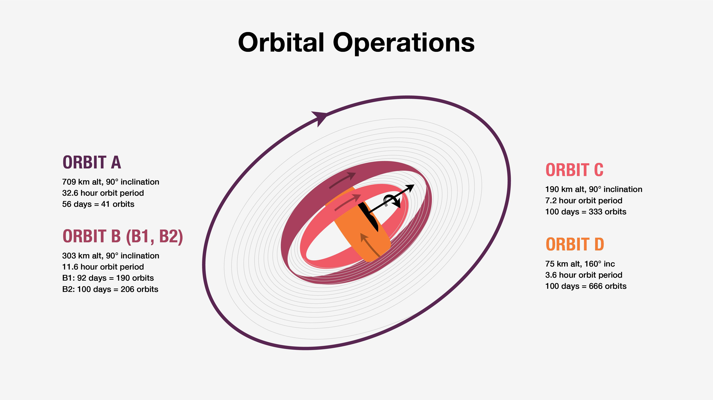
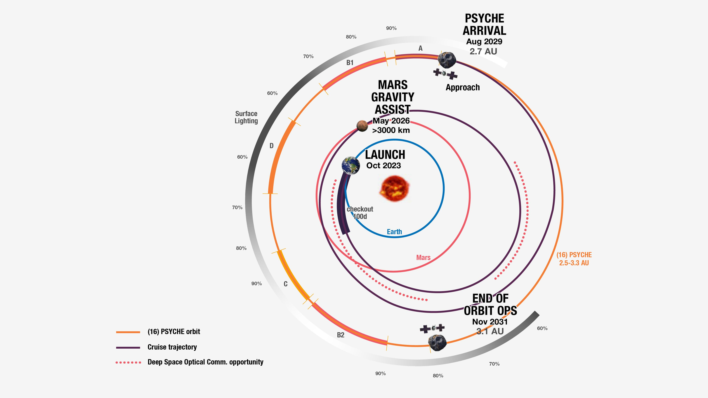

# 🛰️ Psyche

🛰️ **Psyche is** a NASA space mission launched on October 13, 2023 to explore the origin of planetary cores by orbiting and studying the metallic asteroid 16 Psyche.0 NASA's Jet Propulsion Laboratory (JPL) manages the project.  

16 Psyche is the heaviest known M-type asteroid, and may be an exposed iron core of a protoplanet, the remnant of a violent collision with another object that stripped off its mantle and crust. On January 4, 2017, the Psyche mission was selected for NASA's Discovery #14 mission. It was launched atop a SpaceX Falcon Heavy rocket.  

The Psyche spacecraft is traveling to a unique metal-rich asteroid with the same name, orbiting the Sun between Mars and Jupiter. By August 2029 the spacecraft will begin exploring the asteroid that scientists think – because of its high metal content – may be the partial core of a planetesimal, a building block of an early planet.  

# 📡 History

🛰️ **Psyche was** submitted by Lindy Elkins-Tanton, a principal investigator at Arizona State University, as part of a call for proposals for NASA's Discovery Program that closed in February 2015. It was shortlisted on September 30, 2015, as one of five finalists and awarded US$3 million for further concept development.  

On January 4, 2017, Psyche was selected for the 14th Discovery mission, with launch set for 2023. In May 2017, the launch date was moved up to target a more efficient trajectory, to July 2022 aboard a SpaceX Falcon Heavy launch vehicle with a January 31, 2026 arrival, following a Mars gravity assist on May 23, 2023.  

In June 2022 NASA found that the late delivery of the testing equipment and flight software for the Psyche spacecraft did not give them enough time to complete the required testing, and decided to delay the launch, with future windows available in 2023 and 2024 to rendezvous with the asteroid in 2029 and 2030, respectively.  

On October 28, 2022, NASA announced that Psyche was targeting a launch period opening on October 10, 2023, which would correspond with an arrival at the asteroid in August 2029.  

On April 18, 2023, JPL's mission page for Psyche was updated to reflect a new launch date of October 5, 2023. On September 28, 2023, the launch was again delayed to no earlier than October 12, 2023, due to an unspecified issue with the spacecraft. The launch was further delayed to October 13, 2023, due to bad weather.  

An independent review of the delays at JPL reported in November 2022 found understaffing, insufficient planning, and communications issues among engineers and with management. The VERITAS Venus mission was delayed to free up staff to focus on Psyche.  

# 🔭 Target

🛰️ **Psyche is** the heaviest known M-type asteroid, and may be an exposed iron core of a protoplanet, the remnant of a violent collision with another object that stripped off its mantle and crust.  

Recent studies show that it is "a mixed metal and silicate world". Another study considers it to be either a metal core of a protoplanet or "a differentiated world with a regolith composition … peppered with localized regions of high metal concentrations". Radar observations of the asteroid from Earth indicate an iron–nickel composition.  

# Mission overview

**The Psyche spacecraft** is designed with solar electric propulsion, and the scientific payload includes a multispectral imager, a magnetometer, and a gamma-ray spectrometer.  

The mission is designed to perform 21 months of science. The spacecraft was built by NASA Jet Propulsion Laboratory (JPL) in collaboration with SSL (formerly Space Systems/Loral) and Arizona State University.  

It was proposed that the rocket launch might be shared with a separate mission named Athena, that would perform a single flyby of asteroid 2 Pallas, the third-largest asteroid in the Solar System.  

In May 2020, it was announced that the Falcon Heavy carrying Psyche would include two smallsat secondary payloads to study the Martian atmosphere and binary asteroids, named EscaPADE (Escape and Plasma Acceleration and Dynamics Explorers) and Janus respectively, but in September 2020, the EscaPADE Mars atmosphere probe was removed from the plan.  

Janus was later removed from the Psyche mission as well on November 18, 2022, after an assessment determined that it would not be on the required trajectory to meet its science requirements as a result of Psyche's new launch period.  

# 🚀 Science goals and objectives

<ImgZoom src="/psyche/Psyche_illustration.jpg" alt="Artist's illustration depicting the metal-rich asteroid Psyche." class="h-full object-cover">
  Artist's illustration depicting the metal-rich asteroid Psyche.
</ImgZoom>

<ImgZoom src="/psyche/Psyche_features_Shepard2021.jpg" alt="Shape model of asteroid Psyche, with some of the observed surface features indicated." class="h-full object-cover">
  Shape model of asteroid Psyche, with some of the observed surface features indicated.
</ImgZoom>

Differentiation is a fundamental process in shaping many asteroids and all terrestrial planets, and direct exploration of a core could greatly enhance understanding of this process. The Psyche mission aims to characterize 16 Psyche's geology, shape, elemental composition, magnetic field, and mass distribution. It is expected that this mission will increase the understanding of planetary formation and interiors.  

<ImgZoom src="/psyche/Psyche-spacecraft-diagram.png" alt="Psyche Spacecraft Diagram" class="h-full object-cover">
 1. Hall-effect thrusters 2. Optical telecommunications system - 3. Star trackers - 4. Low-gain antenna - 5. Sun sensor - 6. X-band High-gain antenna - 7. Neutron spectrometer - 8. Gamma-ray spectrometer - 9. Cold gas thrusters - 10. -Y Panel - 11. Magnetometer 12. Top deck - 13. +Y Panel - 14. Multispectral imagers (x2
</ImgZoom>

# 🛰️ Instruments onboard of the spacecraft:  
1. Hall-effect thrusters
2. Optical telecommunications system
3. Star trackers
4. Low-gain antenna
5. Sun sensor
6. X-band High-gain antenna
7. Neutron spectrometer
8. Gamma-ray spectrometer
9. Cold gas thrusters
10. -Y Panel
11. Magnetometer
12. Top deck
13. +Y Panel
14. Multispectral imagers (x2)

# Laser communications experiment
<ImgZoom src="/psyche/Psyche_DSOC.jpeg" alt="DSOC's flight transceiver can be identified by its large tube-like sunshade on the Psyche spacecraft, as seen here inside a clean room at JPL." class="h-full object-cover">
  DSOC's flight transceiver can be identified by its large tube-like sunshade on the Psyche spacecraft, as seen here inside a clean room at JPL.
</ImgZoom>

The spacecraft will also test an experimental laser communication technology called Deep Space Optical Communications (DSOC). It is hoped that the device will be able to increase spacecraft communications performance and efficiency by 10 to 100 times over conventional means. The DSOC experiment is NASA's first demonstration of optical communications beyond the Earth-Moon system. DSOC is a system that consists of a flight laser transceiver, a ground laser transmitter, and a ground laser receiver. New technologies have been implemented in each of these elements. The transceiver is mounted on the Psyche spacecraft. The DSOC technology demonstration will begin shortly after launch and continue as the spacecraft travels from Earth to its gravity-assist flyby of Mars. DSOC operations are planned for one year after launch, with extended-mission opportunities to be evaluated. Palomar Observatory's Hale Telescope will receive the high-rate data downlink from the DSOC flight transceiver.  

The Discovery program solicitation offered mission projects an extra $30 M if they would host and test the 25 kg DSOC unit, which needs about 75 Watts. It is hoped to advance DSOC to technology readiness level 6. DSOC tests should begin about 60 days after launch. The test-runs of the laser equipment will occur over distances of 0.1 to 2.5 astronomical units (AU) on the outward-bound probe.  

# Specifically, the science goals for the mission are:  
+ Understand a previously unexplored building block of planet formation: iron cores.
+ Look inside terrestrial planets, including Earth, by directly examining the interior of a differentiated body, which otherwise could not be seen.
+ Explore a new type of world, made of metal.

 

# The science questions this mission aims to address are:  
+ Is Psyche the stripped core of a differentiated planetesimal, or was it formed as an iron-rich body? What were the building blocks of planets? Did planetesimals that formed close to the Sun have very different bulk compositions?
+ If 16 Psyche was stripped of its mantle, when and how did that occur?
+ If 16 Psyche was once molten, did it solidify from the inside out, or the outside in?
+ Did 16 Psyche produce a magnetic dynamo as it cooled?
+ What are the major alloy elements that coexist in the iron metal of the core?
+ What are the key characteristics of the geologic surface and global topography? Does 16 Psyche look radically different from known stony and icy bodies?
+ How do craters on a metal body differ from those in rock or ice? 🛸

<Youtube id="lMFbHb_3e6Q"/>

