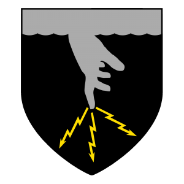

# Sunday Post

So not only is that the title and day today, that is also the title of the featured cover artwork I did quite quickly to demonstrate the use of GIMP in Linux as a seriously professional art tool. Each motion, each stroke is extremely intentional - life or death - and once it was done it was done. It took less than 5 minutes for me, they are all like that, it is instant, one take life or death. I will put my gallery back online.  

  

Now, that is just metaphorically speaking. I'm not actually in some kind of death thrall or whatever. Well, I kinda am, but I don't let emotions into that so that's one way you can tell that I am speaking metaphorically.  

I have to make that point very clear that I am a calm individual. The virus is attacking my stomach like a fire from hell and that is what causes me to start screaming obscenities at anyone who crosses me, which HAPPENS, so I just cuss a lot that's it. Too bad, if you look at who I am cussing at, they are the one's in need of some reprimanding.  

Honestly, I'm proud as hell of my responses and I would share in detail if it mattered to anyone willing to listen.  

  

So I've had nothing but good health recovery, no terrorist organizations have claimed responsibility for my health scare, and all kidding aside, nothing happened. I got sick from everything, that new COVID variant probably had something to do with it as well.  

I never think about death until I can't move. Usually when I'm on the verge of it? Then it's time to deal with it.  

Oh well what can you do. Hopefully I can sell some of my stuff, I just have been cleaning stuff and getting it ready for sale, lots of cleaning solutions and this stuff probably is going to end up running better then when I got from all the maintenance I've been doing.  

  

It's not much, but it will make someone happy and for a good prices too.  

  

Solar Flares.... ~~Go figure~~.  

<Youtube id="IobNcpiwpSc"/>
